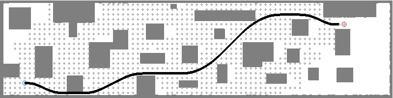

# MRSL Motion Primitive for quadrotor

## Compilation

A) Simple cmake (set USE_ROS to OFF)
```sh
mkdir build && cd build && cmake .. && make
```


B) Using CATKIN with ROS (set USE_ROS to ON)
```sh
$ mv motion_primitive_library ~/catkin_ws/src
$ cd ~/catkin_ws & catkin_make -DCMAKE_BUILD_TYPE=Release
```


## Example Usage
The simple API are provided in the base planner class, please look up in Doxygen. Here are several functions to set up a planning thread:
```c++
std::unique_ptr<MPMapUtil> planner(new MPMapUtil(true)); // Declare a mp planner using voxel map
planner->setMapUtil(map_util); // Set collision checking function
planner->setEpsilon(1.0); // Set greedy param (default equal to 1)
planner->setVmax(2.0); // Set max velocity
planner->setAmax(1.0); // Set max acceleration (as control input)
planner->setDt(1.0); // Set dt for each primitive
planner->setMaxNum(5000); // Set maximum allowed states
planner->setMode(1, false); // 2D discretization with 1
planner->setTol(1, 1); // Tolerance for goal region

bool valid = planner->plan(start, goal); // Plan from start to goal
```

The results from ```MPMapUtil``` are plotted in [output.jpg](https://github.com/sikang/motion_primitive_library/blob/master/data/output.jpg). Grey dots show the expended nodes.


Run following command:
```sh
$ ./build/test_planner_2d ../data/corridor.yaml
[MPPlanner] PLANNER VERBOSE ON
[MPBaseUtil] set epsilon: 1.000000
[MPBaseUtil] set v_max: 2.000000
[MPBaseUtil] set a_max: 1.000000
[MPBaseUtil] set dt: 1.000000
[MPBaseUtil] set max num: 5000
[MPBaseUtil] set n: 1, use_3d: 0
[MPBaseUtil] set tol_dis: 1.000000
[MPBaseUtil] set tol_vel: 1.000000
start pos: [2.500000, -3.500000, 0.000000], vel: [0.000000, 0.000000, 0.000000], acc: [0.000000, 0.000000, 0.000000]
goal pos: [35.000000, 2.500000, 0.000000], vel: [0.000000, 0.000000, 0.000000], acc: [0.000000, 0.000000, 0.000000]
MP Planner takes: 19.000000 ms
MP Planner expanded states: 1429
```

Note that only control space in acceleration is available at this time!


## Doxygen
For more details, please refer to https://sikang.github.io/motion_primitive_library/
