# MRSL Motion Primitive Library ROS
[](https://app.wercker.com/project/byKey/d282a628f39dac13997c792b2298bde0)
- - -
A ROS wrapper for [Motion Primitive Library](https://sikang.github.io/motion_primitive_library/) v1.2. Video of the original paper of "Search-based Motion Planning for Quadrotors using Linear Quadratic Minimum Time Control" has been uploaded at the follwing link: [youtube](https://youtu.be/LMe72buMky8).
The package is still under maintenance, the API may change occasionally, please use `git log` to track the latest update.

Packages:
  - `motion_primitive_library`: back-end for planning trajectory in various environments
  - `planning_ros_msgs`: ROS msgs used in storing, visualizing and communicating
  - `planning_ros_utils`: ROS utils for interfacing with MPL, it also includes mapping and rviz plugins
  - `DecompROS`: tool for convex decomposition and visualization
  - `mpl_external_planner`: several planners that build on the `motion_primitive_library`
  - `mpl_test_node`: example ROS nodes (see following Examples)

## Installation
#### Dependancy:
  - `ROS`(Indigo+)
  - [`catkin_simple`](https://github.com/catkin/catkin_simple)
  - [`SDL`](`sudo apt install -y libsdl1.2-dev libsdl-image1.2-dev`)

##### Compile
Before compiling, make sure submodules are on their corresponding commits.
To initialize the submodule `motion_primitive_library` and `DecompROS`, run following commands:
```bash
$ cd /PATH/TO/mpl_ros
$ git submodule update --init --recursive
```

###### 1) Using Catkin:
```bash
$ mv mpl_ros ~/catkin_ws/src
$ cd ~/catkin_ws & catkin_make_isolated -DCMAKE_BUILD_TYPE=Release
```

###### 2) Using Catkin Tools (recommended):
```bash
$ mv mpl_ros ~/catkin_ws/src
$ cd ~/catkin_ws
$ catkin config -DCMAKE_BUILD_TYPE=Release
$ catkin b
```

## Example Usage
The planner inside `mpl_ros` including:
  - `OccMapPlanner`: uses 2D occupancy grid map
  - `VoxelMapPlanner`: uses 3D voxel grid map
  - `EllipsoidPlanner`: uses 3D point cloud and models robot as ellipsoid in SE(3)
  - `PolyMapPlanner2D`: uses 2D polygonal map and moving obstacles

Following examples demonstrate some of these planners:

#### Example 1 (plan in occ/voxel map)
Simple test using the built-in data in a voxel map can be run using the following commands:
```bash
$ cd ./mpl_test_node/launch/map_planner_node
$ roslaunch rviz.launch
$ roslaunch test.launch
```
It also extracts the control commands for the generated trajectory and saves as
`trajectory_commands.bag`.


The planning results are visualized in Rviz as following:

2D Occ Map | 3D Voxel Map
:--------- | :-----------
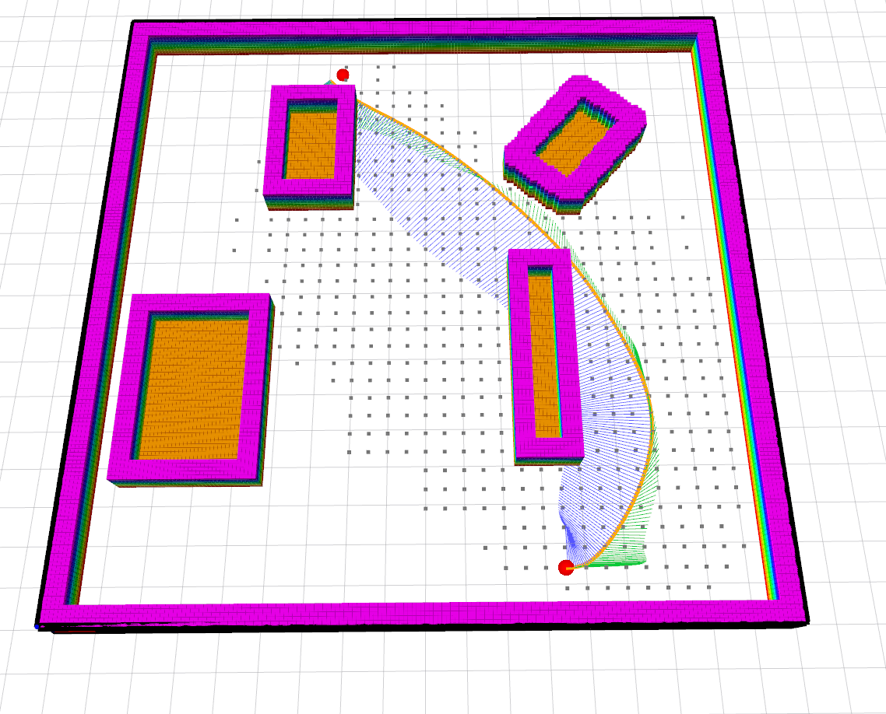 | 


#### Example 2 (plan with moving obstacles)
The planner can also take input polygonal map for collision checking. When the
obstacles are not static, it's able to find the trajectory that avoids future
collision:
```bash
$ cd ./mpl_test_node/launch/poly_map_planner_node
$ roslaunch rviz.launch
$ roslaunch test.launch
```
Static Obstacles | Moving Obtacles
:--------------- | :--------------
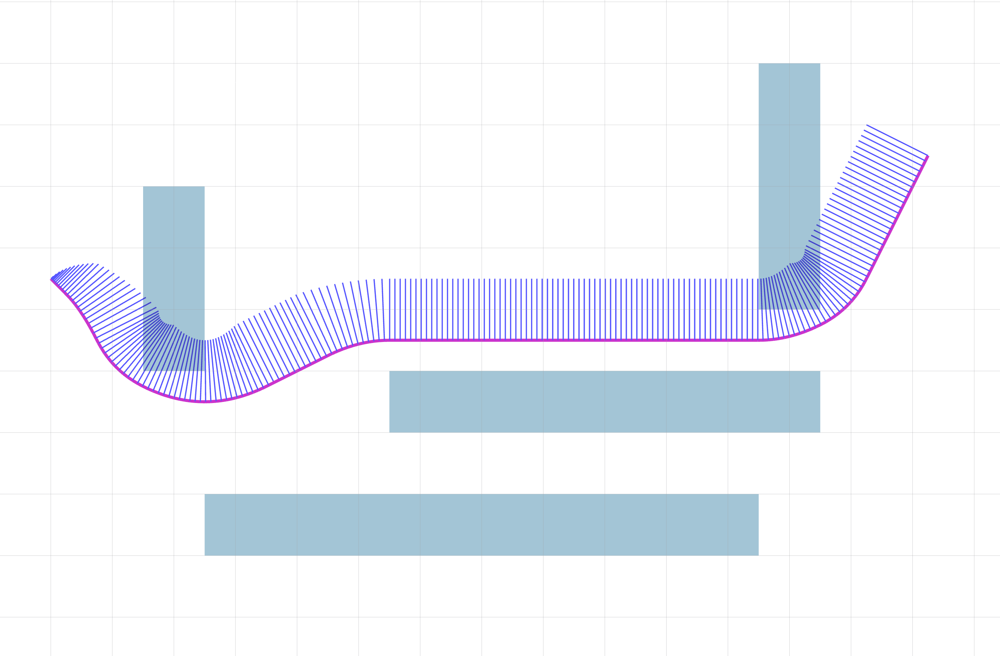 | 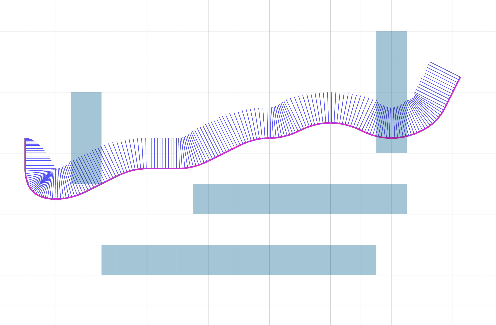


Even if the trajectories of obstacles are non-linear, our planner could find the optimal maneuver for the robot with certain dynamic constraints through one plan:

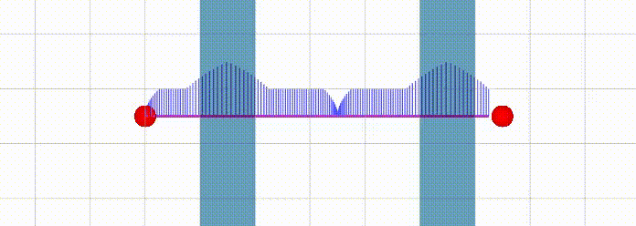

#### Example 3 (multi-robot planning)
The planner can be applied to a team of robots that move in a shared constrained environments.
In the following demo, we show examples of two configurations, in which the planner is running
in a centralized or decentralized mode.
In the centralized mode, the planner runs once in the beginning.
In the decentralized mode, each robot replans constantly at 2Hz with partial knowledge of its surrounding obstacles.

Config1: 10 Robots Centralized | Config2: 16 Robots Centralized
:----------------------------- | :-----------------------------
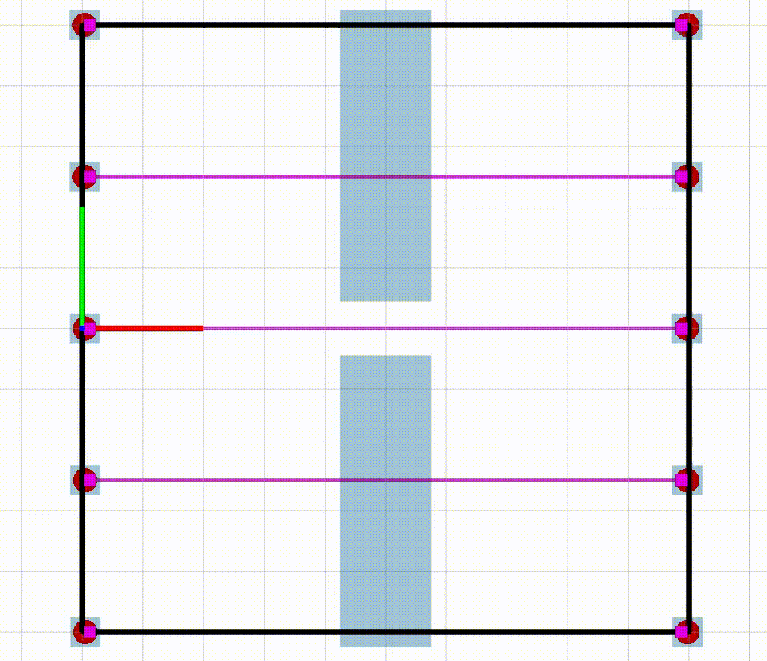 | 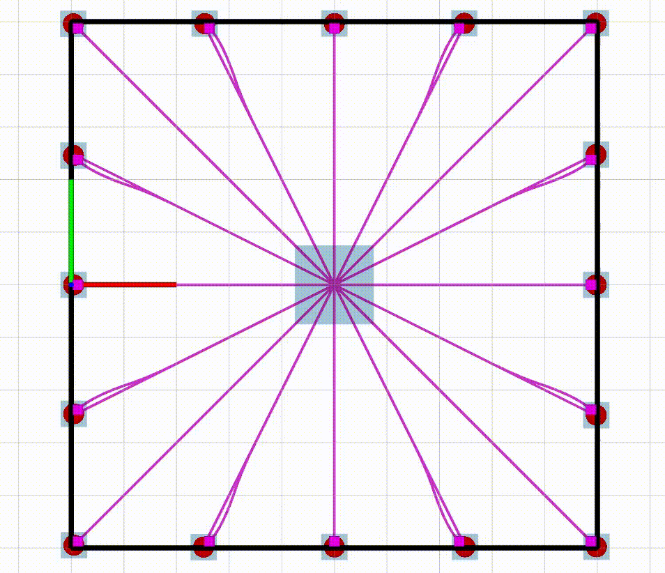

Config1: 10 Robots Decentralized | Config2: 16 robots Decentralized
:------------------------------- | :-------------------------------
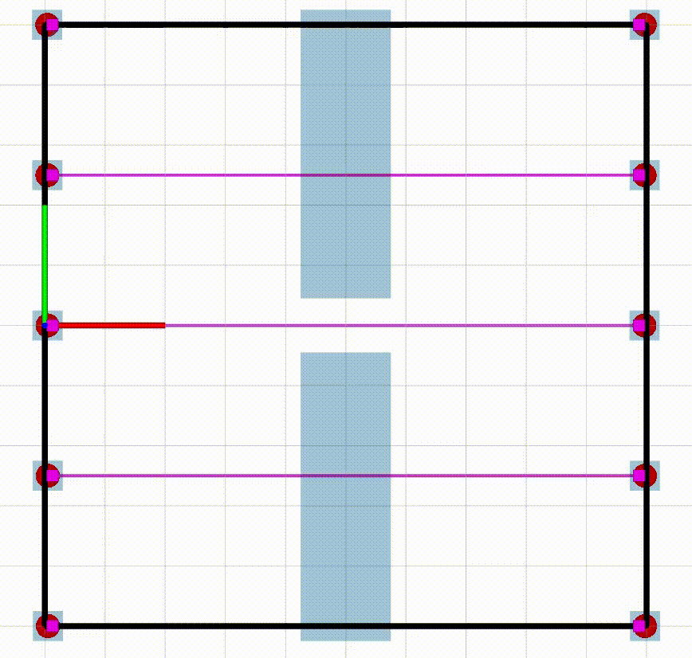 | 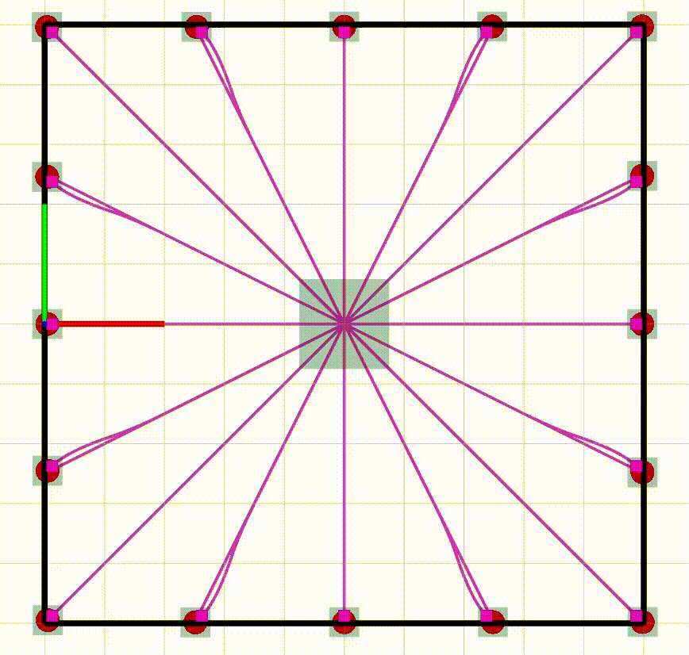


#### Example 4 (plan in SE(3) with ellispoid model)
Another example using ellipsoid model can be found in `mpl_test_node/launch/ellipsoid_planner_node`, in which a point cloud is used as obstacles, and the robot is modeled as the ellipsoid. More information can be found in the paper ["Search-based Motion Planning for Aggressive Flight in SE(3)"](http://ieeexplore.ieee.org/document/8264768/).
```bash
$ cd ./mpl_test_node/launch/ellispoid_planner_node
$ roslaunch rviz.launch
$ roslaunch test.launch
```
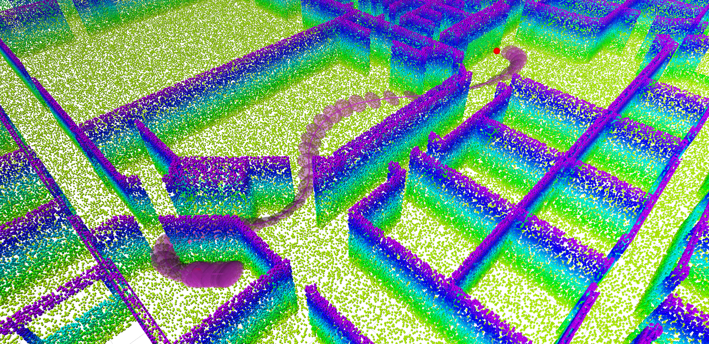

## Maps
The built-in maps are listed as below:

Simple | Levine | Skir | Office
:----- | :----- | :--- | :-----
 |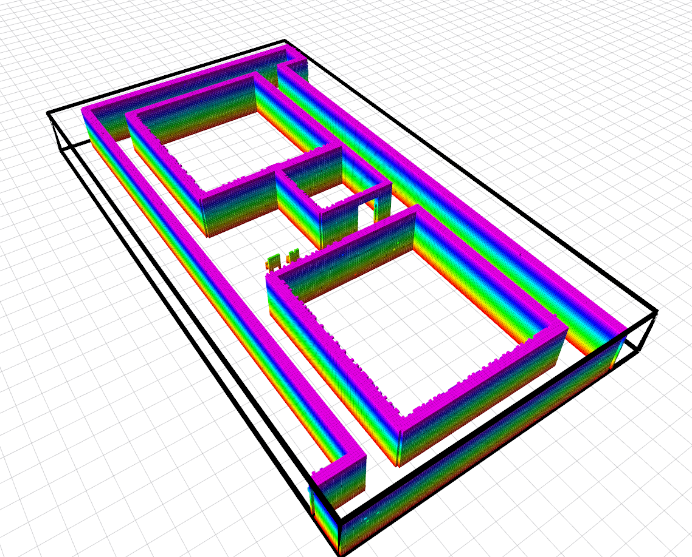 |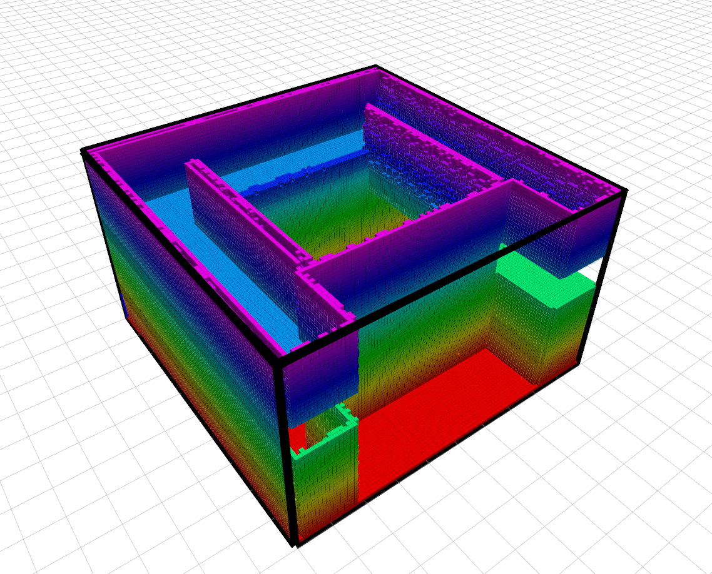 |

User can form their own maps using the `mapping_utils`, a launch file example is provided in `./mpl_test_node/launch/map_generator` for converting a STL file into voxel map.
For details about the full utilities, please refer to [wiki](https://github.com/sikang/mpl_ros/wiki).

