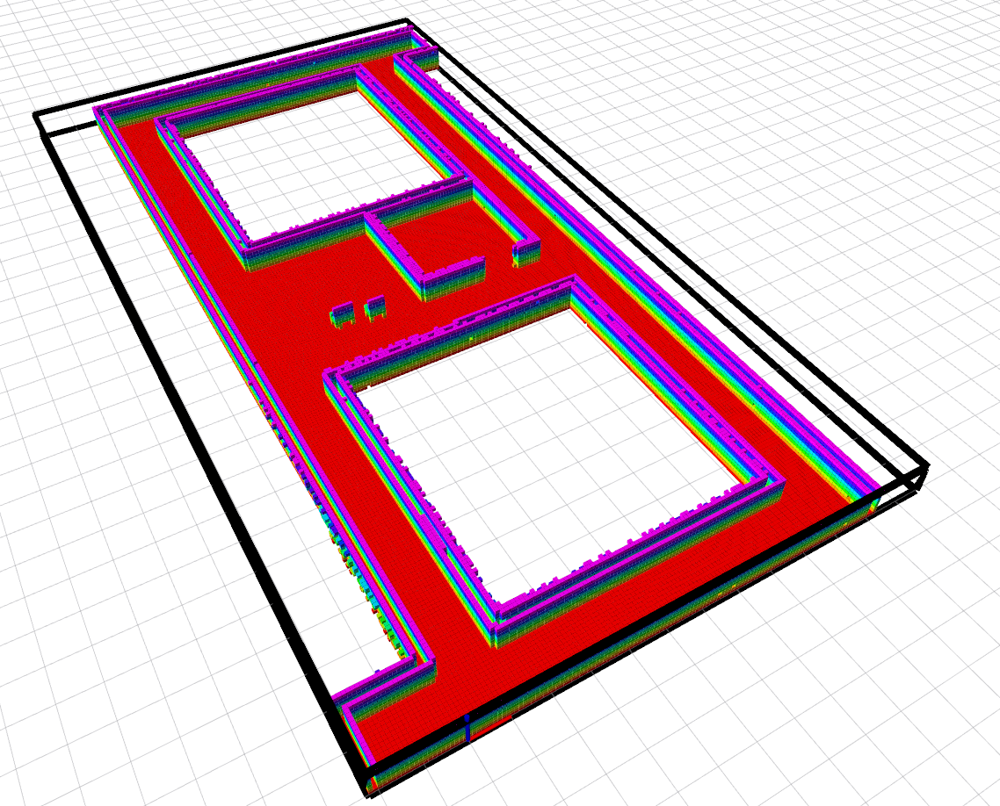

MRSL Motion Primitive Library ROS
=====================
A ROS wrapper for implementing [Motion Primitive Library](https://sikang.github.io/motion_primitive_library/) in planning tasks. Video of the original paper of "Search-based Motion Planning for Quadrotors using Linear Quadratic Minimum Time Control" has been uploaded at the follwing link: [youtube](https://youtu.be/LMe72buMky8).

Stacks include:
  - `decomp_ros`: convex decomposition tools for generating ellipsoid and polyhedron
  - `motion_primitive_library`: back-end for planning trajectory in various environments
  - `planning_ros_msgs`: ROS msgs used in storing, visualizing and communicating 
  - `planning_ros_utils`: ROS utils for interfacing with MPL, it also includes mapping and rviz plugins
  - `test_node`: examples code for simple testing

Check each package for more details.

## Compilation
Prerequisite:
  - `ROS`(Indigo+)
  - [`catkin_simple`](https://github.com/catkin/catkin_simple)

Using Catkin:
```sh
$ mv mpl_ros ~/catkin_ws/src
$ cd ~/catkin_ws & catkin_make -DCMAKE_BUILD_TYPE=Release
```
Using Catkin Tools:
```sh
$ mv mpl_ros ~/catkin_ws/src
$ catkin config -DCMAKE_BUILD_TYPE=Release
$ cd ~/catkin_ws & catkin build
```

## Usage
Simple test using the built-in data can be applied through following commands:
```sh
$ cd ./test_node/launch/test_primitive_map
$ roslaunch rviz.launch
$ roslaunch test.launch
```

You should be able to see some messages as:
```sh
[ WARN] [1499461391.525181641]: Get data!
[MPPlanner] PLANNER VERBOSE ON
[MPBaseUtil] set epsilon: 1.000000
[MPBaseUtil] set v_max: 2.000000
[MPBaseUtil] set a_max: 1.000000
[MPBaseUtil] set dt: 1.000000
[MPBaseUtil] set max num: -1
[MPBaseUtil] set n: 1, use_3d: 0
[MPBaseUtil] set tol_dis: 1.000000
[MPBaseUtil] set tol_vel: 1.000000
start pos: [12.500000, 1.400000, 0.000000], vel: [1.000000, 0.000000, 0.000000], acc: [0.000000, 0.000000, 0.000000]
goal pos: [6.400000, 16.600000, 0.000000], vel: [0.000000, 0.000000, 0.000000], acc: [0.000000, 0.000000, 0.000000]
[ INFO] [1499461394.004879469]: Succeed! Takes 0.055615 sec for planning, expand [727] nodes
================== Traj -- total J: 9.000000, total time: 10.000000
================ Refined traj -- total J: 7.537635, total time: 10.000000
```

Another example using ellipsoid model can be found in `test_node/launch/test_primitive_cloud`, in which a point cloud is used as obstacles, and the robot is modeled as ellipsoid. More information about planning SE(3) space can be found in the paper ["Search-based Motion Planning for Aggressive Flight in SE(3)"](https://arxiv.org/pdf/1710.02748.pdf). 

The planned trajectory and voxel map are visualized in Rviz as:

   

The built-in maps are listed as below:

Simple | Levine | Skir | Office
:----- | :----- | :--- | :-----
 | | | 

User can form their own maps using the `mapping_utils`, a launch file example is provided in `./test_node/launch/map_generator` for converting a STL file into voxel map. 
For details about the full utilities, please refer to [wiki](https://github.com/sikang/mpl_ros/wiki).

