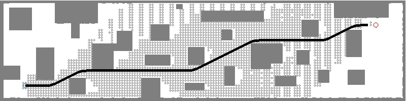

# MRSL Motion Primitive Library for quadrotor v0.3
==================================
## New Feature
  - Add Lifelong Planning Astar to handle replanning in dynamical environments
  - Enable maximum allowed time for searching

## Compilation

A) Simple cmake (set USE_ROS to OFF)
```sh
mkdir build && cd build && cmake .. && make
```


B) Using CATKIN with ROS (set USE_ROS to ON)
```sh
$ mv motion_primitive_library ~/catkin_ws/src
$ cd ~/catkin_ws & catkin_make -DCMAKE_BUILD_TYPE=Release
```


## Example Usage
The simple API are provided in the base planner class, please look up in Doxygen. 

Before planning, the start and goal states must be set up accordingly as:
```c++
// Initialize planning mission 
Waypoint start, goal;
start.pos = Vec3f(2.5, -3.5, 0.0);
start.use_pos = true;
start.use_vel = true;
start.use_acc = false; 
start.use_jrk = false; 
goal.pos = Vec3f(35, 2.5, 0.0);
goal.use_pos = start.use_pos;
goal.use_vel = start.use_vel;
goal.use_acc = start.use_acc;
goal.use_jrk = start.use_jrk;
```

The flags `use_xxx` will adapt the planning in different control space. For example, the one above is control in acc space. Four options are provided by setting those flags as below:

Vel | Acc | Jrk | Snp
:-- | :-- | :-- | :--
`use_pos = true` | `use_pos = true` | `use_pos = true` | `use_pos = true`
`use_vel = false` | `use_vel = true` | `use_vel = true` | `use_vel = true`
`use_acc = false` | `use_acc = false` | `use_acc = true` | `use_acc = true`
`use_jrk = false` | `use_jrk = false` | `use_jrk = false` | `use_jrk = false`


After setting up start and goal states, a planning thread can be started as:
```c++
std::unique_ptr<MPMapUtil> planner(new MPMapUtil(true)); // Declare a mp planner using voxel map
planner->setMapUtil(map_util); // Set collision checking function
planner->setEpsilon(1.0); // Set greedy param (default equal to 1)
planner->setVmax(1.0); // Set max velocity
planner->setAmax(1.0); // Set max acceleration 
planner->setJmax(1.0); // Set max jerk
planner->setUmax(1.0); // Set max control input
planner->setDt(1.0); // Set dt for each primitive
planner->setW(10); // Set dt for each primitive
planner->setMaxNum(-1); // Set maximum allowed states
planner->setU(1, false);// 2D discretization with 1
planner->setMode(start); // Set effort degree
planner->setTol(1, 1, 1); // Tolerance for goal region


bool valid = planner->plan(start, goal); // Plan from start to goal
```


The results from ```MPMapUtil``` are plotted in [output.jpg](https://github.com/sikang/motion_primitive_library/blob/master/data/output.jpg). Grey dots show the expended nodes.


Run following command:
```sh
$ ./build/test_planner_2d ../data/corridor.yaml
```
You should see following messages if it works properly:
```sh
[MPPlanner] PLANNER VERBOSE ON
[MPBaseUtil] set epsilon: 1.000000
[MPBaseUtil] set v_max: 1.000000
[MPBaseUtil] set a_max: 1.000000
[MPBaseUtil] set j_max: 1.000000
[MPBaseUtil] set u_max: 0.500000
[MPBaseUtil] set dt: 1.000000
[MPBaseUtil] set w: 10.000000
[MPBaseUtil] set max num: -1
[MPBaseUtil] set effort in acc
[MPBaseUtil] set tol_dis: 1.000000
[MPBaseUtil] set tol_vel: 1.000000
[MPBaseUtil] set tol_acc: 1.000000
start pos: [2.500000, -3.500000, 0.000000], vel: [0.000000, 0.000000, 0.000000], acc: [0.000000, 0.000000, 0.000000]
goal pos: [37.000000, 2.500000, 0.000000], vel: [0.000000, 0.000000, 0.000000], acc: [0.000000, 0.000000, 0.000000]
MP Planner takes: 87.000000 ms
MP Planner expanded states: 4033
Total time T: 35.000000
Total J:  J(0) = 36.000000, J(1) = 2.250000, J(2) = 0.000000, J(3) = 0.000000
```

## Doxygen
For more details, please refer to https://sikang.github.io/motion_primitive_library/

## ROS Warapper
We also write the interface with ROS for planning using this library, [`mpl_ros`](https://github.com/sikang/mpl_ros.git)
